- 👋 Hi, I’m Tan Jun Kiat (@TanJunKiat)
- 👀 I’m interested in Robotics (design, control development and implementation) 
- 💞️ I’m looking to collaborate on any robotics project
- 📫 Reach me via my email (tanjunkiat@outlook.sg)

<!---
TanJunKiat/TanJunKiat is a ✨ special ✨ repository because its `README.md` (this file) appears on your GitHub profile.
You can click the Preview link to take a look at your changes.
--->

```mermaid
flowchart LR

A("rmf_demos_gz_classic")
B("rmf_demos_gz")
C("rmf_demos")
D("rmf_demos_fleet_adapter")
E("rmf_fleet_adapter_python")
F("rmf_fleet_adapter")
G("rmf_visualization")
H("rmf_task_sequence")
I("rmf_visualization_schedule")
J("rmf_visualization_rviz2_plugins")
K("rmf_visualization_navgraphs")
L("rmf_task_ros2")
M("rmf_task")
N("rmf_traffic_ros2")
O("rmf_traffic_examples")
P("rmf_robot_sim_gz_plugins")
Q("rmf_robot_sim_gz_classic_plugins")
R("rmf_battery")
S("rmf_websocket")
T("rmf_visualization_obstacles")
U("rmf_visualization_floorplans")
V("rmf_visualization_fleet_states")
W("rmf_traffic_editor_test_maps")
T("rmf_traffic_editor")
Y("rmf_traffic")
Z("rmf_sensor_manager")
AA("rmf_robot_sim_common")
AB("rmf_demos_tasks")
AC("rmf_demos_panel")
AD("rmf_demos_maps")
AE("rmf_demos_bridges")
AF("rmf_building_sim_gz_plugins")
AG("rmf_building_sim_gz_classic_plugins")
AH("rmf_visualization_walls")
AI("rmf_visualization_sensors")
AJ("rmf_visualization_sensor_range")
AK("rmf_visualization_building_systems")
AL("rmf_utils")
AM("rmf_task_msgs")
AN("rmf_ingestor_msgs")
AO("rmf_building_sim_common")
AP("rmf_building_map_tools")
AQ("rmf_workcell_msgs")
AR("rmf_visualization_msgs")
AS("rmf_traffic_msgs")
AT("rmf_traffic_editor_assets")
AU("rmf_site_map_msgs")
AV("rmf_scheduler_msgs")
AW("rmf_obstacle_msgs")
AX("rmf_lift_msgs")
AY("rmf_gz_ros2_bridge")
AZ("rmf_fleet_msgs")
BA("rmf_door_msgs")
BB("rmf_dispenser_msgs")
BC("rmf_demos_dashboard_resources")
BD("rmf_demos_assets")
BE("rmf_charger_msgs")
BF("rmf_building_map_msgs")
BG("rmf_api_msgs")
BH("pybind11_json_vendor")
BI("nlohmann_json_schema_validator_vendor")
BJ("menge_vendor")
BK("ament_cmake_catch2")

A --> C
A --> AG
A --> Q
```

