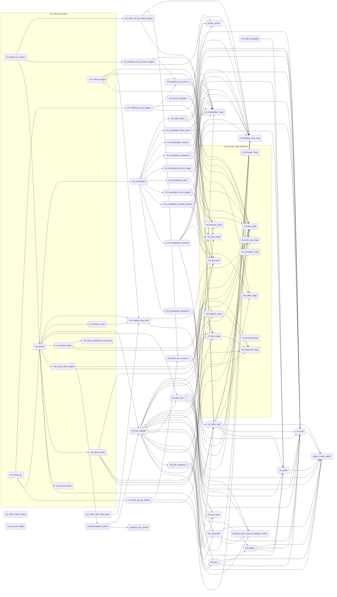

- 👋 Hi, I’m Tan Jun Kiat (@TanJunKiat)
- 👀 I’m interested in Robotics (design, control development and implementation) 
- 💞️ I’m looking to collaborate on any robotics project
- 📫 Reach me via my email (tanjunkiat@outlook.sg)

<!---
TanJunKiat/TanJunKiat is a ✨ special ✨ repository because its `README.md` (this file) appears on your GitHub profile.
You can click the Preview link to take a look at your changes.
--->

